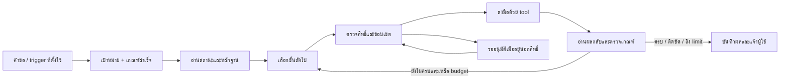

# แผนเพิ่มแขนขาให้มินิคุง: Agent Action Runtime

วันที่: 4 ตุลาคม 2026
สถานะ: มี implementation ของ action runtime, approvals, checkpoint/recovery, grants/monitor, file/workflow/browser adapters และ Cockpit แล้ว ดูรายละเอียดที่ [agent-action-runtime.md](agent-action-runtime.md); คำสั่งสำหรับบริการจริงต้องตั้งและทดลองบนเครื่องเป้าหมาย ส่วน desktop ใช้ fixed workflows

## เป้าหมาย

ให้ผู้ใช้บอกผลลัพธ์ที่ต้องการ แล้วมินิคุงรวบรวมหลักฐาน วางขั้นตอน ลงมือ ตรวจผล และติดตามงานต่อได้ ผู้ใช้เห็นว่าเกิดอะไรขึ้นและหยุดงานได้ทุกเมื่อ

ตัวอย่างงานแรก: “ตรวจสุขภาพ Homelab ถ้าเจอปัญหาให้หาสาเหตุ เตรียมวิธีแก้ และตรวจอีกครั้งหลังแก้”

เลือก Homelab เป็นสมมติฐานตั้งต้นเพราะมี Guardian และ health tools อยู่แล้ว หากผู้ใช้เลือกงานไฟล์หรืองานพัฒนา ให้เปลี่ยนงานทดลองโดยใช้ runtime เดียวกัน

## สิ่งที่มีอยู่แล้ว

| ส่วน | สิ่งที่พบในโค้ด | สิ่งที่ต้องต่อ |
|---|---|---|
| สมอง | `TurnPlanner`, `AgentPlanningService`, Spring AI tool loop | ผูกแผนกับเกณฑ์จบงานและหลักฐานรายขั้น; ปัจจุบัน planned steps เป็นข้อความ |
| แขนดูแลระบบ | `homelab.guardian`, health tools, logs, backups, configured actions | ตั้ง action จริงตามบริการที่เลือก และตรวจสถานะหลังสั่งงาน |
| แขนจัดการเครื่อง | `computer.local`: อ่าน ค้น เขียน ย้าย ลงถังขยะ เปิด app และ fixed workflow | จำกัด root ให้ตรงงาน และต่อผลแต่ละ operation เข้ากับเกณฑ์จบงาน |
| ตาอ่านเว็บ | Browser content และ browser session สำหรับเปิด/อ่าน | การคลิก กรอกฟอร์ม และตรวจผลการส่งฟอร์มเป็นงานเพิ่มในระยะหลัง |
| งานและเวลา | task, planner, notifications, automation recipes | เชื่อม trigger เข้ากับ run ที่มีขอบเขต; recipes ปัจจุบันมี notify/review/create-task |
| ความต่อเนื่อง | PostgreSQL run/step store, background chat, confirmation, resume | กลับมาทำแผนที่เหลือหลังยืนยัน โดยอ่าน checkpoint และตรวจ state ก่อน |
| ตรวจสอบย้อนหลัง | tool traces, Guardian/Computer audit, timeline | ให้ Cockpit แสดงเป้าหมาย ขั้นปัจจุบัน ผลตรวจ และสิ่งที่รอผู้ใช้ |

ข้อค้นพบที่มีผลต่อแผน:

- `AgentExecutionService.complete()` เก็บ `UNVERIFIED` เมื่อยังยืนยันความครบถ้วนของแผนไม่ได้ เป็นฐานที่ควรรักษาจนมี verifier จริง
- `GuardianActionService` ตรวจผล process แต่ exit code สำเร็จยังไม่พิสูจน์ว่าบริการกลับมาทำงานตามเป้าหมาย
- `AgentResumeService` replay failed tool steps แบบ read-only และไม่ resume run ที่รอ confirmation; ยังไม่ใช่การเดินแผนที่เหลือครบวงจร
- ค่า default `minikun.guardian.actions`, `minikun.guardian.backups.targets` และ `minikun.computer.workflows` ยังว่าง; environment ของ deployment อาจตั้งเพิ่มไว้ จึงต้องตรวจ configuration จริงก่อนทดลอง
- รากไฟล์ default ครอบคลุมทั้ง volume บางส่วน; งานแรกควรใช้ root แคบตามงานและสิทธิ์ของ process

## วงจรเป้าหมาย

ต่อจาก Spring Boot, Spring AI, PostgreSQL และ tool registry เดิม เริ่มด้วย worker ที่ทำขั้นตอนตามลำดับหนึ่งตัว ความรู้ที่อ่านจาก log/เว็บ/ไฟล์เป็นข้อมูลสำหรับวิเคราะห์ ไม่สามารถให้สิทธิ์ลงมือแทนผู้ใช้ได้

## แผนส่งมอบตามลำดับ

### ระยะ 1 — เปิดใช้แขนขาที่มีอยู่กับงานจริงหนึ่งงาน

- เลือกบริการทดลองหนึ่งตัวที่กระทบต่ำ พร้อม health probe และ log source ที่ตรวจได้
- ตรวจ runtime configuration, การยืนยันตัวผู้ใช้ และ owner scope ของช่องทางที่ใช้ลงมือ
- ตั้ง log source, action allowlist และ root ที่จำเป็นต่อบริการนี้; คำสั่งเป็นรายการ argv ที่ระบบกำหนดเอง
- ทำเส้นทางตรวจ → อ่าน log → เสนอ action → ผู้ใช้ยืนยัน → สั่ง action → ตรวจ health ซ้ำ
- ส่งมอบ trace ที่แสดงทั้งก่อนและหลัง ไม่ใช้ข้อความจากโมเดลเป็นหลักฐานว่าหายแล้ว

เกณฑ์ผ่าน: ทำเส้นทางนี้กับบริการทดลองได้จริง และแยกผล “สั่งสำเร็จแต่ยัง unhealthy” ออกจาก “กลับมาทำงานแล้ว”

### ระยะ 2 — ผูกแผนกับผลลัพธ์ที่ตรวจได้

- ขยายข้อมูลใน run/step เดิมให้มี target, expected outcome, verification result และ evidence reference
- เริ่มจากแผนแบบกำหนดไว้สำหรับงานแรก: inspect, diagnose, propose, execute, verify
- ผูก step กับ tool call จริง และตรวจ domain result เช่น `success=false` แม้ transport/tool wrapper จะสำเร็จ
- การตรวจ health ใช้ probe และ bounded polling; การตรวจไฟล์ใช้ path/hash; การตรวจ task ใช้ record ที่อ่านกลับ
- ให้ `COMPLETED` ได้เมื่อครบทุกเกณฑ์ที่ตรวจได้ หากตรวจไม่ครบคง `UNVERIFIED`
- สำหรับงานทั่วไปที่ยังไม่มี verifier ให้รายงานข้อจำกัดของหลักฐานตามจริง

เกณฑ์ผ่าน: agent ไม่ประกาศจบเมื่อคำสั่งล้มเหลว หรือเมื่อเป้าหมายยังไม่เกิดขึ้นจริง

### ระยะ 3 — ทำงานต่อหลังอนุมัติและกู้คืนอย่างถูกต้อง

- เก็บ checkpoint ของขั้นที่เสร็จและขั้นถัดไปในฐานข้อมูลเดิม
- ผูก approval กับ owner, run, action, target และ arguments fingerprint พร้อม expiry
- ตรวจ approval จาก state ฝั่ง server; ค่า `confirmed=true` ที่โมเดลส่งมาอย่างเดียวให้สิทธิ์ไม่ได้
- หลังอนุมัติให้ดำเนินขั้นที่เตรียมไว้ แล้วตรวจผลและเดินแผนที่เหลือโดยใช้ run เดิม
- หลัง restart หรือ timeout อ่านผลจริงก่อนตัดสินใจเดินต่อ; write ที่ไม่ทราบผลห้าม replay อัตโนมัติ
- ตั้ง deadline, tool-step budget, repair-attempt budget และตรวจ cancellation ก่อนเริ่มทุกขั้น
- หากหยุดระหว่าง tool ทำงาน ให้แสดงว่างานที่เริ่มไปแล้วอาจยังดำเนินอยู่ และตรวจผลภายหลัง

เกณฑ์ผ่าน: restart ไม่ทำ action ซ้ำ, approval ของอีกงานใช้แทนกันไม่ได้ และยกเลิกแล้วไม่เริ่มขั้นใหม่

### ระยะ 4 — ให้อิสระตามขอบเขตที่ผู้ใช้ตั้ง

- เพิ่ม policy ฝั่ง server ที่จุดเรียก tool กลาง เพื่อครอบคลุม native loop, deterministic router และ scheduler
- แยกชนิดผลกระทบออกจากการต้องยืนยัน: read-only, reversible write, operational action, external send
- policy ระบุ tool/action, resource, ข้อจำกัดจำนวนครั้งและเวลา; เก็บผู้อนุมัติและช่องทางเพิกถอน
- เริ่มด้วยตรวจอ่านอัตโนมัติ และอนุมัติ action ครั้งต่อครั้งตามพฤติกรรมเดิม
- จากนั้นเปิดสิทธิ์ล่วงหน้าสำหรับงานแคบ เช่น restart เฉพาะบริการทดลองได้หนึ่งครั้งต่อ incident พร้อม cooldown และตรวจ health หลังทำ
- งานนอก policy หยุดที่ preview ซึ่งระบุเป้าหมาย ผลกระทบ และหลักฐานก่อนขออนุมัติ
- เชื่อม Guardian trigger และ scheduler เดิมกับ run นี้ พร้อม dedup ตาม incident และแจ้งเมื่อมีการเปลี่ยนแปลงที่ต้องรู้

เกณฑ์ผ่าน: ทำงานในสิทธิ์ได้ต่อเนื่อง แต่คำสั่งนอกขอบเขตถูกหยุดแม้ผ่าน router หรือ scheduler

### ระยะ 5 — ขยายงานที่ทำได้

ลำดับขึ้นกับงานที่ผู้ใช้ทำจริง:

1. ไฟล์และเอกสาร: จัดไฟล์ใน root เฉพาะ, สร้างรายงาน, ตรวจ hash/ปลายทางหลังเขียนหรือย้าย
2. งานส่วนตัว: รับเป้าหมาย แตกเป็น task ตั้งเวลา และติดตามผลผ่านระบบเดิม
3. งานพัฒนา: fixed workflows สำหรับ build/test ใน checkout แยก, แสดง diff และเก็บผลทดสอบก่อนเสนอ merge/deploy
4. เว็บที่ต้องลงมือ: ต่อ browser session ด้วย click/fill และอ่าน state หลัง action; approval ผูกกับโดเมนและรายการที่จะส่ง
5. Desktop UI: เพิ่มเฉพาะ workflow ที่ API/CLI/browser ทำไม่ได้ พร้อมดูสถานะใหม่ก่อนลงมือ

เพิ่ม adapter ทีละประเภทโดยใช้ execution/policy/verification เดิม ค่า credentials อยู่ฝั่ง server และแต่ละ adapter รับเพียงสิทธิ์ที่จำเป็นต่อหน้าที่

เกณฑ์ผ่าน: เพิ่มแขนใหม่ได้โดยไม่สร้าง planner, approval หรือ audit ซ้ำอีกชุด

### ระยะ 6 — ทำให้ผู้ใช้เห็นและควบคุมงานได้

- ต่อ Cockpit เดิมให้เห็นเป้าหมาย แผน ขั้นปัจจุบัน หลักฐานล่าสุด และเหตุผลที่หยุด
- มี action สำหรับอนุมัติ ปฏิเสธ ยกเลิก และตรวจงานที่ผลยังไม่ชัดเจน
- หน้าตั้งสิทธิ์แสดงว่าอนุญาตอะไรกับ resource ไหน พร้อมเพิกถอนสิทธิ์ได้
- จบงานด้วยผลที่ตรวจแล้ว สิ่งที่ยังติดขัด และลิงก์ artifact/audit ที่เกี่ยวข้อง

ส่วนแสดงผลพื้นฐานควรทำพร้อมระยะ 1–3 แล้วจึงขยายหน้าตั้งสิทธิ์ในระยะ 4

## ขอบเขต MVP

รวมระยะ 1–3 และหน้าสถานะพื้นฐาน โดยเริ่มจาก Homelab หนึ่งบริการ การเขียนหรือ restart ยังใช้ explicit approval ตามระบบเดิม

งานที่ต้องสาธิตครบ:

1. บริการ healthy: ตรวจและรายงาน ไม่สั่งแก้โดยไม่จำเป็น
2. บริการ unhealthy: อ่านหลักฐาน เสนอ action ยืนยัน ลงมือ และตรวจผลอีกครั้ง
3. action ไม่ช่วย: รายงานว่ายังมีปัญหาและหยุดตาม budget
4. restart runtime ระหว่างงาน: กู้คืนจาก checkpoint โดยตรวจผลก่อนและไม่ทำ write ซ้ำ
5. ผู้ใช้ปฏิเสธ/ยกเลิก หรือ action นอกสิทธิ์: ไม่มีขั้นเปลี่ยน state เริ่มขึ้นภายหลัง

การตรวจสำคัญเพิ่มเติม: target เปลี่ยนหลัง preview, approval หมดอายุ, owner ไม่ตรง, probe ใช้ไม่ได้, prompt injection ใน log และ false-success จาก tool result

## จุดเริ่มงานในโค้ด

| งาน | จุดต่อหลัก |
|---|---|
| Outcome และ checkpoint | `com/minikun/agent/execution/AgentRun.java`, `AgentExecutionService.java`, `AgentResumeService.java` และ store/schema เดิม |
| Plan และ bounded loop | `AgentPlanningService.java`, `com/minikun/tools/springai/SpringAiToolCallingRuntime.java` |
| Policy ฝั่ง server | `com/minikun/tools/DefaultToolExecutor.java`, `ToolCallContext.java`, confirmation services/routers เดิม |
| Homelab action + verification | `com/minikun/guardian/GuardianActionService.java`, `HomelabGuardianService.java`, `com/minikun/tools/HomelabGuardianTool.java` |
| Event/notification | Guardian scheduler, `com/minikun/personalloop/SafeAutomationService.java` และ notification runtime เดิม |
| แสดงสถานะ | execution API และ `src/main/resources/static/cockpit/` |

เริ่มลงมือจากระยะ 1 เพื่อพิสูจน์ว่า tools ที่มีทำงานจริงในเครื่องเป้าหมาย แล้วพัฒนาระยะ 2–3 จากข้อจำกัดที่พบ เปิด autonomy หลังผ่านการกู้คืนและตรวจผลแล้ว ส่วน browser/desktop และระบบหลาย agent เพิ่มเมื่อมีงานจริงที่ต้องใช้
