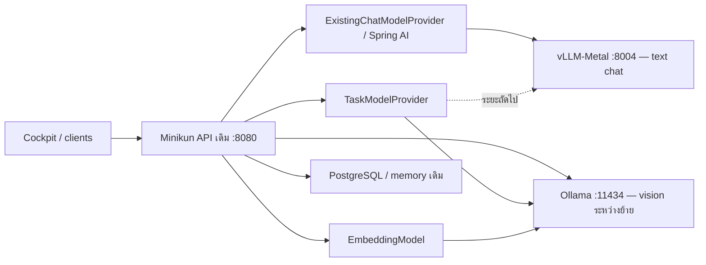

# แผนย้าย Minikun จาก Ollama ไป vLLM บน Mac mini M4

วันที่: 5 ตุลาคม 2026 · สถานะ: แผนสำหรับลงมือ ยังไม่ได้ติดตั้งหรือสลับบริการ

## แนวทางที่แนะนำ

ใช้ **vLLM-Metal ผ่าน MLX บน Mac mini M4 RAM 24 GB เครื่องเดิม** เริ่มจากแชตข้อความหลัก แล้วจึงย้ายงานเบื้องหลังและ embeddings หลังผ่านการวัดความเร็วและคุณภาพ ใช้ provider boundary ที่มีอยู่และ Spring AI OpenAI adapter เพื่อคง API ฝั่ง Cockpit และ clients เดิม

vLLM-Metal เป็น hardware plugin สำหรับ Apple Silicon ต้องใช้ macOS 15+ และ Python arm64 3.12 เครื่องนี้ตรวจพบ macOS 26.6.1 จึงผ่านข้อกำหนดเบื้องต้น รุ่น stable ที่ตรวจเมื่อจัดทำแผนคือ **vLLM-Metal 0.30.0 คู่กับ vLLM core 0.30.0** ให้ตรึงทั้งคู่และ dependency ชุดเดียวกันระหว่างการทดลอง [release 0.30.0](https://github.com/vllm-project/vllm-metal/releases/tag/v0.30.0), [installation](https://github.com/vllm-project/vllm-metal/blob/v0.30.0/docs/installation.md)

ความเร็วที่เพิ่มขึ้นยังไม่ทราบ: batching และ prefix caching มีโอกาสช่วยเมื่อบริบทยาวหรือมีหลายคำขอพร้อมกัน แต่คำถามสั้นทีละคำขออาจดีขึ้นน้อย ต้องวัดบน M4 ของเราเอง ผลบน M5 Pro และ RAM 64 GB ใช้แทนผลเครื่องนี้ไม่ได้ [benchmark ของโครงการ](https://vllm.ai/blog/2026-09-22-vllm-metal-v0-28-0)

## สิ่งที่ตรวจพบในระบบปัจจุบัน

| ส่วน | สถานะที่ตรวจพบ | ผลต่อการย้าย |
| --- | --- | --- |
| เครื่อง | Mac mini M4, unified memory 24 GB | ใช้ Metal/MLX และเผื่อ RAM ให้ macOS กับบริการอื่น |
| Runtime | Java 25, Spring Boot 4.1.0, Spring AI 2.0.0 | เพิ่ม OpenAI adapter ภายใต้ BOM เดิม |
| โมเดลหลัก | `/v1/models/runtime` รายงาน `hf.co/llmfan46/gemma-4-E4B-it-ultra-uncensored-heretic-GGUF:Q6_K` | ต้องรักษา checkpoint และทดสอบพฤติกรรมภาษาไทย/บุคลิก |
| Task model ใน config | `hf.co/mradermacher/llama3.2-typhoon2-3b-GGUF:Q4_K_M` | reflection, summary, title และงาน JSON ยังเรียก native Ollama |
| Embedding ใน config | `qwen3-embedding:0.6b` | ใช้กับ long-term memory และ knowledge retrieval |
| Context ใน config | 16,384 tokens | ต้องตรงกับ server และจองพื้นที่คำตอบ |
| Ports | Ollama 11434, Java 8080, SSH listener 8000, TinyGrad 8002 | เลือก vLLM ที่ `127.0.0.1:8004`; ตรวจอีกครั้งก่อนรัน |
| โมเดลที่ resident | `/api/ps` ว่าง ณ เวลาที่ตรวจ | เป็น snapshot ขณะ idle ไม่ใช่ baseline ความเร็ว |

Ollama และ task/embedding ชื่อข้างต้นเป็นค่าที่พบใน source config; ยืนยัน environment ของ process ที่ deploy อีกครั้งก่อนเปลี่ยนจริง Working tree มีงานค้างหลายส่วน จัดการ migration เป็นชุดแก้แยกจากงานเหล่านั้น

## โมเดลและความสามารถที่ต้องรักษา

Gemma 4 แบบข้อความรองรับใน vLLM-Metal 0.30.0 แต่ **GGUF Gemma 4 Q6_K ที่ใช้อยู่ไม่สามารถย้ายไฟล์ตรง ๆ ตาม loader scope ของรุ่นนี้** ซึ่งจำกัด family และ quantization การย้ายจึงต้องหา MLX checkpoint ที่มาจาก weights เดียวกัน หรือแปลงจาก safetensors ของ [checkpoint ต้นทาง](https://huggingface.co/llmfan46/gemma-4-E4B-it-ultra-uncensored-heretic) พร้อม tokenizer/chat template และ metadata ที่จำเป็น [model matrix ของรุ่น 0.30.0](https://github.com/vllm-project/vllm-metal/blob/v0.30.0/docs/supported_models.md)

เริ่มทดสอบ MLX 4-bit เพื่อเผื่อหน่วยความจำ หากคุณภาพตกค่อยลอง quantization ที่ละเอียดขึ้น 4-bit ไม่เทียบเท่า Q6_K จึงต้องรายงานผลเป็นการเปลี่ยนทั้ง engine และ quantization หากหา checkpoint/quantization ที่เทียบกันไม่ได้

ใช้ [mlx-community/gemma-4-e4b-it-4bit](https://huggingface.co/mlx-community/gemma-4-e4b-it-4bit) เฉพาะ smoke test ของ engine ได้ แต่เป็น Gemma มาตรฐานคนละ checkpoint กับ heretic จึงไม่ควรนำคะแนนมาอ้างว่าเป็นผลของการย้าย backend เพียงอย่างเดียว และไม่ใช่ตัวเลือก production โดยอัตโนมัติ

**Vision เป็น gate แยก:** ในรุ่นที่ตรึง Gemma 4 ใช้เส้นทาง text-only compatibility; native vision ของ Gemma ใน development branch ไม่ใช่หลักฐานว่ารุ่น stable ใช้ได้ ต้องคง Ollama สำหรับคำขอภาพระหว่างการย้าย หรือทดสอบรุ่น/โมเดลที่รองรับภาพครบก่อน cutover ทั้งหมด ห้ามปล่อย `capabilities().vision()` เป็น true เมื่อ server รับภาพไม่ได้ [configuration ของรุ่นที่ตรึง](https://github.com/vllm-project/vllm-metal/blob/v0.30.0/docs/configuration.md)

## สถาปัตยกรรมช่วงย้าย



ใช้ feature/config switch เลือก backend ที่ขอบเขตโมเดล ไม่เพิ่ม proxy, gateway service หรือ framework อีกชุด ฝั่ง clients ยังใช้ `mini-kun` และ `/v1/chat/completions` ของ Minikun ตามเดิม การเลือกโมเดลภายในชี้ไปยัง alias ที่ vLLM serve จริง

## ระยะ 0 — เก็บ baseline และยืนยัน checkpoint

1. บันทึก launchd/config ที่ใช้จริง, revision ของ code, ชื่อโมเดล/digest, generation options และ resource usage โดยไม่เก็บ secrets หรือบทสนทนาส่วนตัว
2. เก็บ baseline Ollama ด้วยชุด synthetic: แชตไทยสั้น, history ยาว, memory recall, tool read-only, JSON และภาพ; แยก cold load ออกจาก warm requests
3. ตรวจ disk headroom สำหรับ weights ต้นทาง, MLX output และ cache; แปลงครั้งเดียวพร้อมบันทึก source revision และ quantization ไม่ดาวน์โหลดทุก quant พร้อมกัน
4. ยืนยันว่า heretic checkpoint โหลดบน vLLM-Metal ได้, template ถูกต้อง, tokens/stop/JSON และ tool calls ใช้งานได้ก่อนแก้แอป

ส่งมอบ: baseline report และรายการ checkpoint/version ที่ทำซ้ำได้ หากรักษา checkpoint ไม่ได้ ให้ระบุ model change เป็นการตัดสินใจแยกก่อนใช้งานจริง

## ระยะ 1 — ทดลอง engine แยกจาก Minikun

ติดตั้ง stable release แล้วตรวจให้ได้คู่ 0.30.0; คำสั่ง Homebrew อาจติดตั้งรุ่นใหม่ในอนาคต จึงบันทึกและตรึง version ที่ทดสอบจริง ห้ามอัปเกรดชุด dependency กลาง benchmark

```bash
brew tap vllm-project/vllm-metal https://github.com/vllm-project/vllm-metal
brew install vllm-project/vllm-metal/vllm-metal
vllm --version
```

ตัวอย่างต่อไปนี้เป็น **smoke test ด้วยโมเดลมาตรฐาน**; ตอนทดสอบ production candidate เปลี่ยน model argument เป็น absolute path ของ heretic MLX checkpoint ที่ผ่านระยะ 0:

```bash
vllm serve mlx-community/gemma-4-e4b-it-4bit \
  --served-model-name minikun-main \
  --host 127.0.0.1 --port 8004 \
  --gpu-memory-utilization 0.45 \
  --max-model-len 8192 \
  --max-num-seqs 2 \
  --enable-prefix-caching \
  --kv-cache-dtype auto \
  --enable-auto-tool-choice --tool-call-parser gemma4
```

Parser flags อ้างอิง [Gemma 4 recipe](https://docs.vllm.ai/projects/recipes/en/stable/Google/Gemma4.html); ต้องตรวจ payload และ template ของ checkpoint จริงบน Metal ด้วย ไม่อนุมานความสำเร็จจาก CUDA recipe

`0.45` คือจุดเริ่มทดลอง ไม่ใช่ memory ceiling ที่พิสูจน์แล้ว ต้องดู resident memory, pressure และ swap จริง เริ่ม 8K/2 requests เพื่อตรวจโหลด จากนั้นเพิ่มเป็น **16,384** และตั้ง token budget ของแอปให้ตรงก่อนเปรียบเทียบกับ production baseline ถ้า 16K ไม่พอให้วัดผลที่ 8K ทั้งสอง backend และรายงาน context reduction แยก

ตรวจ `/health`, `/v1/models`, non-stream และ SSE ที่ `/v1/chat/completions`, usage, finish reason, JSON response format และ tool call หนึ่งรอบ ปิด speculative decoding ไว้ก่อนและใช้ KV dtype `auto`; ค่า FP8/NVFP4 KV ไม่รองรับใน Metal รุ่นนี้ [release boundaries](https://github.com/vllm-project/vllm-metal/releases/tag/v0.30.0)

ระหว่าง benchmark แต่ละ engine ให้มี main model resident เพียงชุดเดียว และควบคุม background workloads เหมือนกัน การปล่อย Ollama main + vLLM main + TinyGrad ใช้ memory พร้อมกันจะทำให้ผลและความเสถียรคลาดเคลื่อน

ส่งมอบ: engine report, memory peak และข้อจำกัดที่พบ โดยยังไม่เปลี่ยน production routing

## ระยะ 2 — ย้าย text chat และ tool runtime

| จุดแก้ | งานที่ต้องทำ |
| --- | --- |
| `pom.xml` | เพิ่ม `spring-ai-starter-model-openai` ภายใต้ Spring AI BOM เดิม; คง Ollama starter สำหรับ embeddings/เส้นทางช่วงย้าย |
| `application.properties`, model wiring | เลือก chat auto-configuration ให้มีตัวหลักชัดเจน เช่น `spring.ai.model.chat=openai`, embedding ยัง `ollama`; มี switch กลับค่าเดิมได้ |
| `ExistingChatModelProvider`, `DefaultActiveChatModelProvider` | ใช้ wrapper/registry เดิมและฉีด ChatModel ที่เลือก; vision capability ต้องตาม endpoint จริง |
| `SpringAiPromptAdapter`, `ChatPromptFactory`, `ChatService` | แยก Ollama-specific options จาก OpenAI/vLLM options; model/context budget ต้องอ่าน config ของ backend ที่เลือก |
| `SpringAiToolCallingRuntime` | ปัจจุบันสร้าง `OllamaChatOptions` เสมอ; เปลี่ยนให้ mutate options ของ backend ที่เลือกและรักษา callbacks, tool context, internal execution policy |
| `ChatModelGateway`, `CommunicationService` | finalizer/thinking options และข้อความสื่อสารต้องไม่สร้าง Ollama options ให้ vLLM |
| `PonyPromptChatService`, `VisionSearchQueryService`, `MainModelPonyPromptTransformer` | audit caller ที่ยังสร้าง Ollama options; text/JSON ใช้ options ที่เลือก ส่วน image routing ต้องคง endpoint ที่รองรับ |
| `ModelsService`, `ModelRuntimeController` | catalog ของ vLLM ใช้ `/v1/models` แทน `/api/tags`; UI เลือกได้เฉพาะโมเดลที่ server serve ไม่ใช่ไฟล์ใน disk ทุกตัว |
| system health / deploy | เพิ่ม probe `vllm=127.0.0.1:8004`; แยก LaunchAgent ของ engine, ใช้ executable absolute path และ readiness ก่อนรับงาน |

รักษาค่า sampling ที่มีผลกับบุคลิก: temperature, max tokens, stop, top-k/top-p, min-p และ repetition penalty ใช้ vLLM extensions เมื่อ adapter รองรับและตรวจ wire payload จริง ไม่แปลง repeat penalty เป็น frequency penalty เพราะเป็นคนละความหมาย

Spring AI 2.x เปลี่ยน implementation ของ OpenAI adapter แล้ว จึงต้องยืนยันชื่อ property และ URL ที่ส่งจริงด้วย dependency 2.0.0 ของ repo เป้าหมายคือ **POST `http://127.0.0.1:8004/v1/chat/completions`** ห้ามใช้ config เก่าจนเกิด `/v1/v1` และตั้ง SDK retries ให้เหมาะกับ tool runtime [Spring AI OpenAI reference](https://docs.spring.io/spring-ai/reference/api/chat/openai-chat.html)

เก็บ reasoning peers เดิมไว้ แยกเวลาที่รอ ChatGPT/Kimi จาก local generation; เปลี่ยน local engine ไม่ได้ลดเวลาบริการภายนอกโดยตรง ไม่ replay tool loop หลัง timeout เพราะ write อาจสำเร็จแล้ว

ทดสอบแบบ isolated profile/database และปิด scheduled writes ที่ไม่เกี่ยวกับ evaluation เพื่อไม่ให้ instance ทดลองทำ reflection, planner หรือ actions ซ้ำกับ production

เกณฑ์ผ่าน: chat non-stream/SSE, history, memory, tool result และ confirmation scopes เดิมครบ; model catalog ถูกต้อง; ตัดจบตาม limit ถูกต้อง; route ภาพยังทำงานตามเดิม จึงเปิดใช้กับคำขอข้อความจริงเป็นช่วงทดลองได้

## ระยะ 3 — ย้ายงานเบื้องหลังและลดจำนวนโมเดล resident

เริ่มให้ TaskModelProvider ใช้ `minikun-main` ผ่าน vLLM instance เดียวเพื่อวัดว่าคิวงานเบื้องหลังทำให้แชตช้าลงหรือไม่ ยังไม่เปิด task engine ตัวที่สองบน RAM 24 GB โดยอัตโนมัติ หาก Typhoon คุณภาพ/เวลาเหนือกว่า ให้คง Typhoon ช่วงย้าย หรือพิจารณา MLX engine แยกหลังวัด memory budget แล้ว

`OllamaTaskModelProvider` มี OpenAI request/response branch อยู่แล้ว สามารถนำ logic นี้มาใช้ต่อด้วยชื่อ/การตั้งค่าที่ตรง backend และเลือก `/v1/chat/completions`; ไม่จำเป็นต้องเขียน HTTP layer ใหม่ แต่ต้องแก้ `reasoning_effort` ซึ่งปัจจุบันอนุมานจาก Ollama family และตรวจ JSON format กับ timeout บน vLLM

ไล่ `TaskModelConfiguration`, `TaskModelRegistry`, `TitleGenerationConfiguration`, `MainModelMemoryClient`/`MemoryConfiguration`, `AiKnowledgeRankingService`/`KnowledgeSelectionConfiguration` รวมถึง callers ของ task provider การตั้ง task provider อย่างเดียวไม่ย้าย direct `OllamaApi` calls และ title configuration ปัจจุบันยังยอมรับเฉพาะ `ollama`

เกณฑ์ผ่าน: summary, reflection, preference extraction, title, planner/search decision, visual JSON และ knowledge ranking ผ่าน suite เดิม คำตอบแชตระหว่างงานเบื้องหลังไม่ช้าลงเกินเกณฑ์ท้ายแผน

## ระยะ 4 — Embeddings และ vision ก่อนเลิกใช้ Ollama

**Embeddings:** คง `qwen3-embedding:0.6b` บน Ollama ระหว่างสามระยะแรก เพราะไม่จำเป็นต้องเปลี่ยน vector store เพื่อย้ายแชต Metal text pooling ยังระบุ experimental [pooling documentation](https://docs.vllm.ai/projects/vllm-metal/en/latest/text_embedding_pooling/)

เมื่อจะย้าย ใช้ checkpoint Qwen3-Embedding ที่ตรงกัน ตรวจมิติ **1024 ที่รายงานจาก Ollama model metadata**, normalization, query instruction, truncation และ batching เทียบ reference หากเปลี่ยน embedding space หรือความเข้ากันได้ไม่ผ่าน ให้ backfill เป็น vector version ใหม่และเก็บของเดิมสำหรับ rollback ห้ามนำ query vector รุ่นใหม่ไปเทียบกับ stored vector รุ่นเก่าเพียงเพราะมิติเท่ากัน ทดสอบ recall ภาษาไทยและ owner isolation ก่อนสลับ พร้อมวัด resource ของ pooling server แยก

**Vision:** ตรึงรุ่นที่ทดสอบภาพได้จริงและ checkpoint ที่มี vision weights/processor ครบ หรือคง backend ภาพเดิมจนผ่าน acceptance tests ต้องตรวจ image-to-text search, Cockpit image input และ capability reporting ให้ครบ การพัฒนา vision บน branch ใหม่เป็นงานที่ต้องประเมินแยกจาก text migration

คง TinyGrad สำหรับสร้างภาพตามเดิม แต่ทดสอบ chat/vision/เสียงพร้อม image generation ด้วย RAM จริงก่อนเปิดใช้พร้อมกัน หากเกิน budget ให้ serialize งานที่หนักหรือคืนหน่วยความจำของ engine ด้วยวิธีที่รุ่นนั้นรองรับ แค่ lock HTTP request ไม่ได้คืน weights/KV ที่ resident อยู่

เกณฑ์เลิก Ollama: ไม่มี production caller ของ native API เหลือ, embeddings และ vision ผ่านแล้ว, install scripts/model catalog/health/guardian repair ใช้ runtime ใหม่ และ rollback snapshot ยังพร้อม ถ้า gate ใดไม่ผ่านให้รายงานว่าเป็น hybrid migration ไม่ประกาศว่าลบ Ollama ได้แล้ว

## วิธีพิสูจน์ว่ามินิคุงเร็วขึ้น

ทดสอบ engine และ Minikun end-to-end แยกกัน ใช้ prompt/history/output cap/options เดียวกัน; รัน 3 warmups แล้วอย่างน้อย 30 measured requests ต่อกลุ่มสำหรับสำรวจ และยืนยันผลกลุ่มตัดสินใจด้วย 100 requests ทำซ้ำ 3 รอบ แยก concurrency 1/2/4 และ cold-start ไม่ใช้ cache-hit ทุกเคสจนคะแนนดูดีเกินงานจริง

| กลุ่ม | สิ่งที่วัด |
| --- | --- |
| ภาษาไทยสั้น/ยาว | TTFT ของ content token แรก, end-to-end p50/p95, completion tokens และ tokens/s |
| History 4K/8K/16K | prefix hit/miss; repeated prefix และบทสนทนาที่แก้/แตก branch |
| Tool/JSON | tool correctness, parse success, loop count และการไม่ทำ action ซ้ำ |
| Memory/knowledge | recall relevance, scope และ task/embedding latency |
| งานเสียง/ภาพพร้อมแชต | RAM peak, memory pressure, swap growth, timeout และ p95 ของแชต |
| Reasoning peers | local generation แยกจาก peer/network/tool latency |

ใช้ metrics เดิม `minikun.chat.stage.duration`, `minikun.chat.generation.tokens` และ generation outcomes ประกอบกับ client-side TTFT ที่กรอง SSE heartbeat/role/empty chunk; ค่า tokens/s ของแอปต้องตรวจว่ารวมหรือแยก prefill ก่อนเทียบกับ engine decode throughput

`tools/eval-intelligence.py` ปัจจุบันส่ง native `/api/chat` และอ่าน NDJSON: วางงานเพิ่ม OpenAI/SSE mode ใน harness เดิม แล้วใช้ intelligence suite เดิมก่อน/หลัง ส่วน `tools/eval-conversations.py` ใช้ตรวจ Minikun API จริงกับ test state แยก คะแนน model-only ไม่ยืนยัน persistent memory หรือ tool side effects

เกณฑ์ตัดสินใจที่เสนอ (เป็นเป้าหมาย ยังไม่มีผลวัด):

- warm TTFT p95 ลดอย่างน้อย **20%** ใน workload หลัก และ end-to-end p95 ไม่แย่ลงเกิน **5%** ที่ concurrency 1
- throughput ที่ concurrency 2 เพิ่มอย่างน้อย **25%** และ p95 latency ของงานหลักไม่แย่ลงเกิน **5%**; ทดสอบ concurrency 4 เพื่อหาขีดจำกัด ไม่ใช่บังคับ production ให้รับ 4 เสมอ
- intelligence score ลดไม่เกิน **2 percentage points** พร้อมทบทวนคำตอบบุคลิก/ภาษาไทย; critical memory scope, confirmation และ tool correctness ต้องผ่านทุกเคส
- ไม่มี OOM, crash หรือ memory pressure แดง และไม่มี swap โตต่อเนื่องในช่วงทดสอบงานร่วม

ถ้าเร็วขึ้นเฉพาะ concurrency แต่แชตเดี่ยวช้าลง ให้รายงาน tradeoff และยังคง Ollama เป็น default สำหรับ workload เดิม

## Cutover และ rollback

1. เก็บ config/checkpoint/version เดิม และตรวจ readiness ของ vLLM ก่อนเปิด text traffic
2. ทดลอง traffic ข้อความในช่วงที่ควบคุม background workload ได้ เฝ้า p95, error, memory และคุณภาพ จากนั้นขยายเมื่อผ่านเกณฑ์
3. ทั้งการทดลองและ rollout ต้องนับ memory ของ Ollama vision/task/embedding ที่อาจกลับมาโหลด ไม่ถือว่าการ idle หมายถึงไม่มีการแย่ง RAM ในอนาคต
4. Trigger rollback: engine crash/OOM, critical tool/memory failure หรือ p95 เกินเกณฑ์ซ้ำในหลายรอบ
5. หยุดรับคำขอใหม่และ drain/cancel generation ตาม deadline; งาน tool ที่ผลไม่ชัดเจนต้องตรวจผล ห้าม replay จากการสลับ engine
6. คืน config chat/options/model catalog เป็น Ollama, หยุด vLLM เพื่อคืน RAM แล้ว restart Minikun และตรวจ chat/vision/tools/embeddings
7. หลัง cutover ผ่าน workload จริงครบหนึ่งรอบการใช้งานรายวัน จึงพิจารณาย้ายส่วนถัดไป การถอน Ollama ทำได้หลังระยะ 4 เท่านั้น

## ชุดงานสำหรับลงมือ

1. **Baseline + checkpoint + engine trial:** ได้รายงาน M4/24 GB ที่ทำซ้ำได้
2. **Text chat adapter + tools + catalog + rollback:** ได้ migration switch และ compatibility tests
3. **Task/direct Ollama calls:** ใช้ endpoint ใหม่โดยไม่ทำ background jobs ซ้ำ
4. **Embedding/vision acceptance + resource coordination:** ตัดสินใจเลิก Ollama หรือบันทึกข้อจำกัด hybrid อย่างชัดเจน

เริ่มงานชุดที่ 1 ก่อน ผลจากชุดนี้จะตัดสินว่าคุ้มกับการย้ายบนเครื่องเดิมหรือไม่ และกำหนดค่า memory/context/concurrency สำหรับชุดถัดไป
